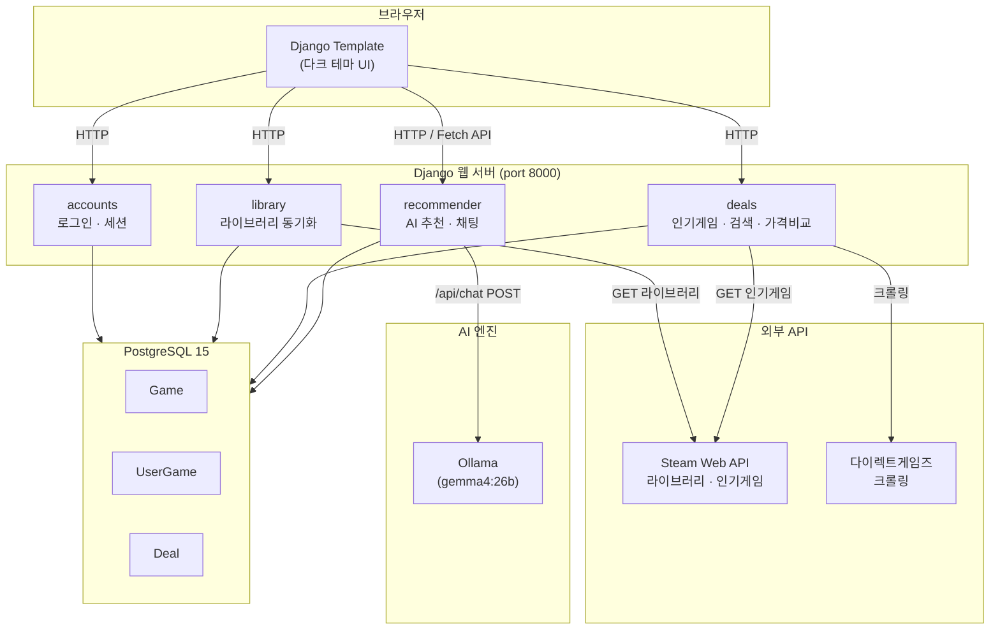
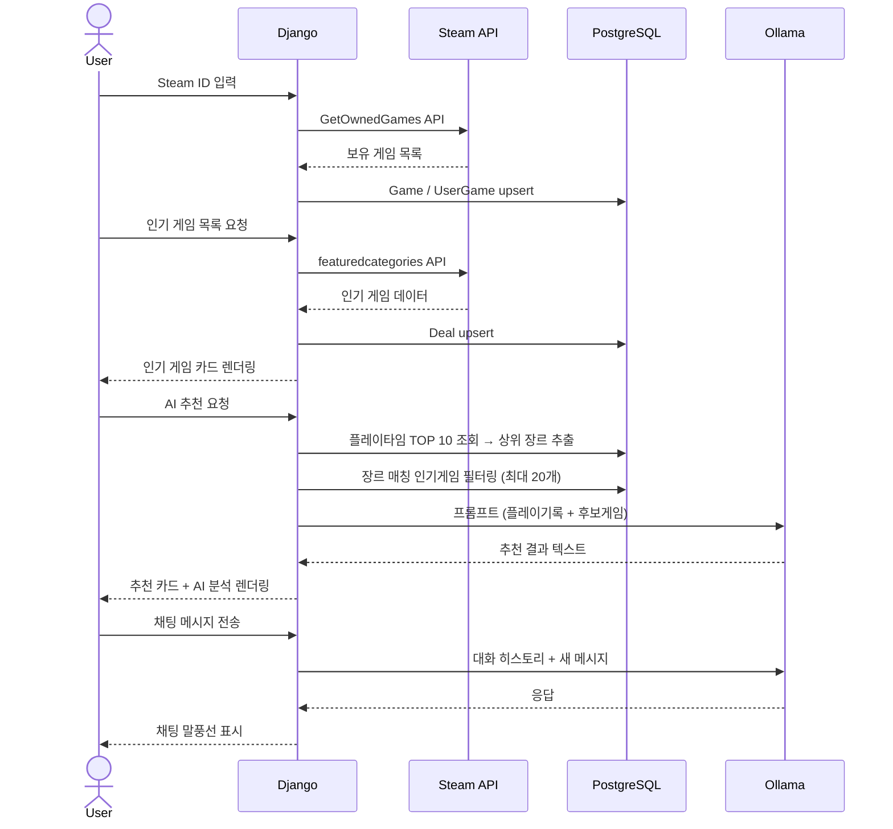

# 🎮 Steam Game Recommender

스팀 라이브러리를 분석해 현재 인기 게임 중 취향에 맞는 게임을 AI가 추천해주는 Django 웹 서비스입니다.  
추천 결과를 받은 뒤 AI와 직접 대화하며 추가 질문을 이어갈 수 있습니다.

---

## 주요 기능

| 기능 | 설명 |
|------|------|
| 🔐 Steam 로그인 | Steam ID 입력으로 즉시 사용 (가입 불필요) |
| 📚 라이브러리 동기화 | Steam Web API로 보유 게임 + 플레이타임 자동 수집 |
| 🏷️ 인기 게임 목록 | Steam Top Sellers 기반 인기 게임 수집, 장르 필터 · 가격비교 배지 |
| 🤖 AI 추천 | Ollama 로컬 LLM이 플레이 기록을 분석해 게임 3개 추천 |
| 💬 AI 채팅 | 추천 결과를 컨텍스트로 유지하며 멀티턴 대화 가능 |
| 🔍 게임 검색 | DB에 수집된 게임을 이름·한국어 이름으로 즉시 검색 |
| 💰 가격 비교 | Steam과 다이렉트게임즈 가격을 한눈에 비교 |

---

## 인기 게임 수집 기준

- **Steam Top Sellers + Top Rated** 합산 (중복 제거)
- 무료 게임 제외
- 리뷰 기준 필터링:
  - 압도적 긍정적 / 매우 긍정적 → 무조건 포함
  - 긍정적 → 리뷰 1,000개 이상인 경우만 포함
- 성적 콘텐츠(descriptor ID 3·4) 제외

---

## AI 추천 최적화

플레이타임 가중치 기반으로 사용자 상위 장르를 추출하고, 후보 게임을 그 장르에 매칭되는 게임으로 우선 선별합니다.

```
플레이타임 TOP 10 게임 → 장르별 플레이타임 합산 → 상위 5개 장르 추출
                                        ↓
            인기 게임 중 해당 장르 포함 게임 우선 선택 (최대 20개)
                                        ↓
                        부족하면 평점순 fallback으로 채움
                                        ↓
                        Ollama에 최종 후보 전달
```

후보 게임 수를 40개→20개로 줄이고 프롬프트를 간소화하여 응답 속도를 개선했습니다.

---

## 아키텍처



---

## 데이터 흐름



---

## 기술 스택

| 구분 | 기술 |
|------|------|
| 백엔드 | Django 4.x, Python 3.11 |
| AI 엔진 | Ollama (gemma4:26b) |
| 크롤링 | requests, BeautifulSoup4 |
| 외부 API | Steam Web API |
| DB | PostgreSQL 15 |
| 프론트엔드 | Django Templates, Vanilla JS |
| 인프라 | Docker, Docker Compose |

---

## 프로젝트 구조

```
steam_recommender/
├── config/              # Django 설정 및 루트 URL
├── accounts/            # Steam ID 로그인 · 세션 관리
├── library/             # 라이브러리 동기화, Steam API 클라이언트
├── deals/               # 인기게임 수집, 크롤러, 검색, 가격비교
│   └── management/commands/fetch_deals.py
├── recommender/         # Ollama 클라이언트, 프롬프트, 채팅 API
├── templates/           # HTML 템플릿 (다크 테마)
├── Dockerfile
└── docker-compose.yml
```

---

## 빠른 시작

### 1. 환경 설정

```bash
cp .env.example .env
# .env 파일에 STEAM_API_KEY 입력
```

### 2. 컨테이너 실행

```bash
docker compose up --build
```

### 3. 최초 1회 초기화

```bash
# Ollama 모델 다운로드
docker compose exec ollama ollama pull gemma4:26b

# DB 마이그레이션
docker compose exec web python manage.py migrate

# 인기 게임 데이터 수집
docker compose exec web python manage.py fetch_deals
```

### 4. 접속

브라우저에서 `http://localhost:8000` 접속 후 Steam ID를 입력하면 바로 사용할 수 있습니다.

---

## 환경 변수

| 변수 | 설명 | 예시 |
|------|------|------|
| `STEAM_API_KEY` | Steam Web API 키 | [발급](https://steamcommunity.com/dev/apikey) |
| `SECRET_KEY` | Django 시크릿 키 | 랜덤 문자열 |
| `DEBUG` | 디버그 모드 | `True` / `False` |
| `DATABASE_URL` | PostgreSQL 연결 URL | `postgresql://...` |
| `OLLAMA_BASE_URL` | Ollama 서버 주소 | `http://ollama:11434` |
| `OLLAMA_MODEL` | 사용할 LLM 모델 | `gemma4:26b` |

---

## 자주 쓰는 명령어

```bash
# 인기 게임 데이터 수동 갱신
docker compose exec web python manage.py fetch_deals

# 컨테이너 로그 확인
docker compose logs web -f

# DB 초기화 (볼륨 포함 삭제)
docker compose down -v
```

---

## 주의사항

- Steam 프로필이 **비공개**이면 라이브러리를 불러올 수 없습니다. Steam 설정에서 공개로 변경해주세요.
- Ollama 모델 최초 다운로드는 모델 크기에 따라 수 분이 걸릴 수 있습니다.
- Steam API는 하루 100,000 요청 제한이 있습니다.
